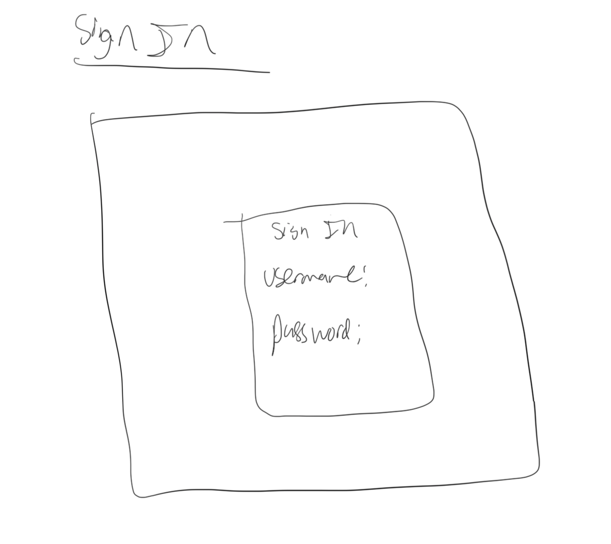
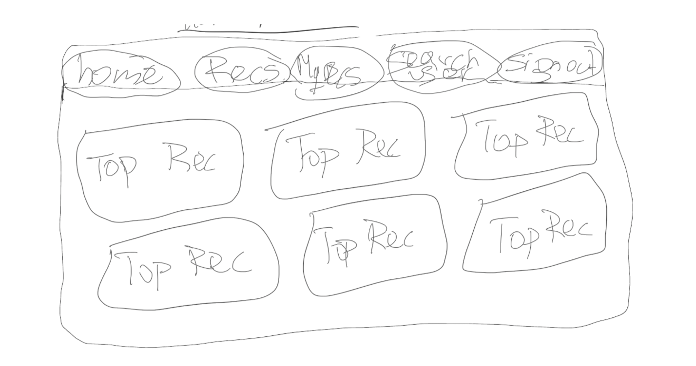
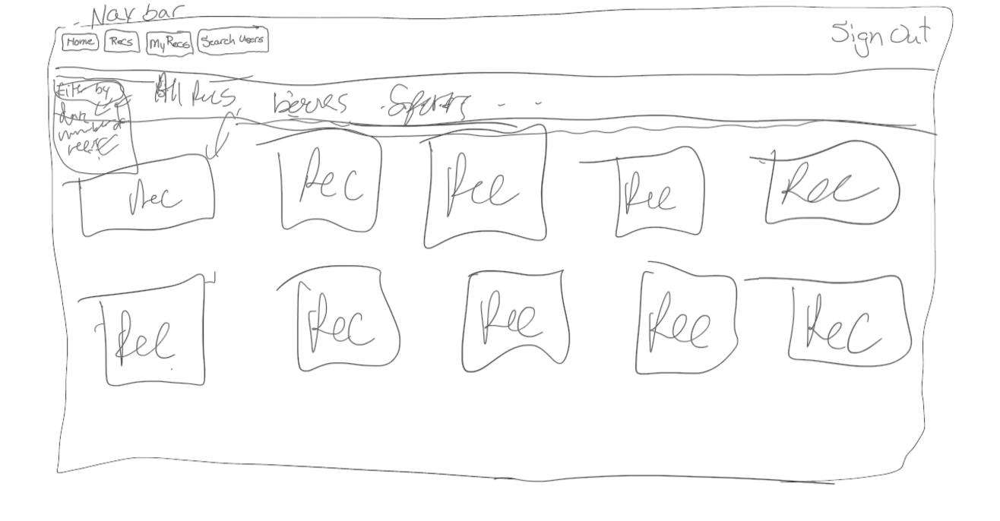
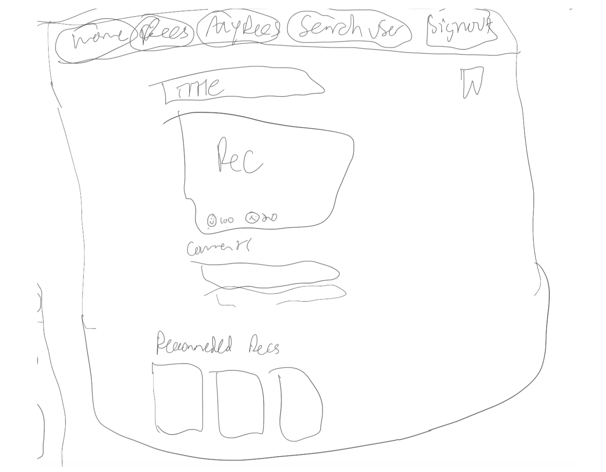
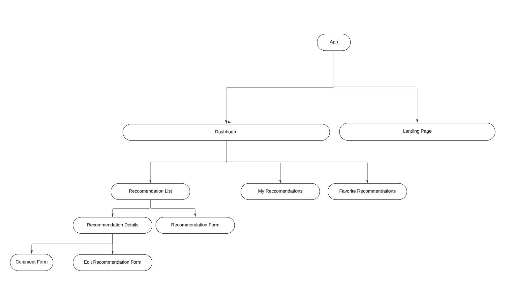

# RECiT Proposal

##  Overview
RECiT is a social recommendation app designed for users to discover and share suggestions on anything they believe others might find valuable or interesting. Whether it's books, movies, restaurants, products, or experiences, RECiT provides an engaging space for users to exchange their favorite recommendations seamlessly.

Key Features

Create, Update, and Manage Recommendations (Recs): Users can easily create, edit, or delete their own recommendations, ensuring their insights remain fresh and relevant.

Curate Personal Favorites: Users can add others’ Recs to their favorites, creating a personalized list of recommendations tailored to their interests.

## Value Proposition
RECiT simplifies the process of finding trusted recommendations while encouraging meaningful connections and engagement between users. By allowing individuals to share their insights and favorite discoveries, the app creates a vibrant ecosystem of knowledge and inspiration.

## MVP
- AAU, I should be able to sign up, sign in, and sign out of my account.
- AAU, I should be able to read, create, edit, and delete a recommendation.
- AAU, I should be able to REC a post.
- AAU, I should be able to read, add, edit, and delete comments to RECs.
- AAU, I should be able to add RECs to my favorites list.

## Stretch Goals

- AAU, I should be able to display a sound or video clip.
- AAU, I should be able to view other users' profiles.
- AAU: I should be able to DM the user that posted the REC.
- AAU: I should be able to see the best and the worst RECs.

## Wireframe
### Landing Page:

### Sign-Up page:

### Sign-In page:

### Dashboard:

### All RECit page:

### RECit Detail:

### My RECit page:

### My Favorite RECit page:

## ERD Diagram

## Component Diagram

## Routes

### My Recommendations

| Action | Route                                   | HTTP Verb |
|--------|----------------------------------------|-----------|
| Index  | `/user/my-recommendations`             | GET       |
| Show   | `/user/my-recommendations/:recommendationId` | GET       |

### My Favorites

| Action | Route                                   | HTTP Verb |
|--------|----------------------------------------|-----------|
| Index  | `/user/my-favorites`                   | GET       |
| Show   | `/user/my-favorites/:my-favoritesId`   | GET       |

### Recommendations

| Action  | Route                                   | HTTP Verb |
|---------|----------------------------------------|-----------|
| Index   | `/recommendations`                     | GET       |
| Create  | `/recommendations/new`                 | POST      |
| Show    | `/recommendations/:recommendationId`   | GET       |
| Edit    | `/recommendations/:recommendationId/edit` | GET       |
| Update  | `/recommendations/:recommendationId`   | PUT       |
| Delete  | `/recommendations/:recommendationId`   | DELETE    |

### Comments

| Action | Route                                                   | HTTP Verb |
|--------|--------------------------------------------------------|-----------|
| Create | `/recommendations/:recommendationId/comments`          | POST      |
| Delete | `/recommendations/:recommendationId/comments/:commentId` | DELETE    |

### Timeline

| Day           | Tasks                                                                                              |
|---------------|----------------------------------------------------------------------------------------------------|
| **Tuesday**   | - Create Proposal                                                                                  |
| **Wednesday** | - Present Proposal and start backend controllers, services, middleware, and models after approval. |
|               | - Try to complete.                                                                                 |
| **Thursday**  | - Finish up backend and ensure the server is running.                                              |
|               | - Test for any bugs.                                                                               |
|               | - Start authentication for the front end.                                                         |
| **Friday**    | - Finish authentication, then start on components:                                                |
|               |   - Landing page                                                                                   |
|               |   - Sign up                                                                                       |
|               |   - Sign in                                                                                       |
|               |   - Navbar                                                                                        |
|               |   - Dashboard                                                                                     |
|               |   - Recommendation form                                                                           |
|               |   - Recommendation list                                                                           |
|               |   - Details                                                                                       |
|               |   - Comment form                                                                                  |
|               |   - My recommendations                                                                            |
|               |   - My favorites                                                                                  |
| **Over Break**| - Test the front end and finish.                                                                   |
|               | - Work on styling and implementing stretch goals.                                                 |
